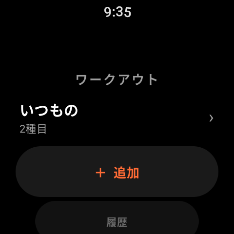
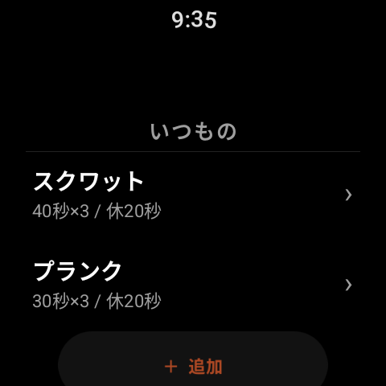
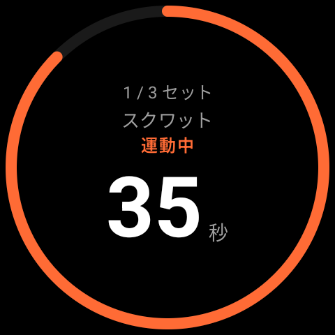
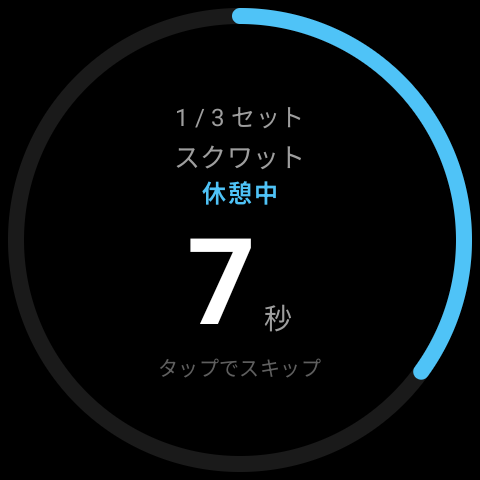
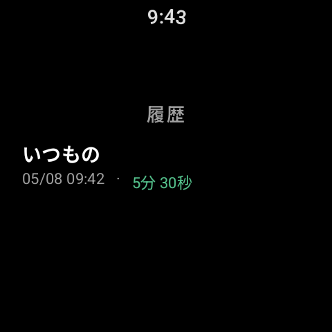

  
  <h1>Intervo</h1>
  
<strong>Wear OS インターバルタイマー</strong>

  

    
    
    
  

---

  

 

## 機能

| | |
|---|---|
| **ワークアウト管理** | 「上半身」「脚の日」など複数メニューを作成・保存 |
| **エクササイズ編集** | 種目名・運動時間・セット数・休憩時間をウォッチ単体で設定 |
| **インターバルタイマー** | 運動 → 休憩を自動進行。残り3秒からカウントダウンバイブ |
| **音声ガイド** | 「始め」「休憩」「完了」を日本語で読み上げ。画面を見なくてもOK |
| **休憩スキップ** | 休憩中にタップするだけで次のセットへ即移行 |
| **次の種目プレビュー** | タイマー中に次の種目名を表示 |
| **ワークアウト履歴** | 完了したトレーニングを日付・所要時間付きで自動記録 |
| **Ambient Mode 対応** | スリープ中も残り時間を常時表示。バッテリー節約 |

## スクリーンショット

  
  
  

  
  
  

## ドキュメント

- [ビルド・実機インストール手順](docs/build.md)
- [実装計画](docs/plan/wear-os-interval-timer.md)
- [E2E テスト（シナリオベース）](docs/e2e-testing.md)

## 開発

`adb` / `gradlew` / `git` のよく使う操作を、権限プロンプトなしで通す薄ラッパーを `scripts/` に用意している（ホワイトリスト方式。破壊的操作は拒否して生コマンドへ誘導）。AI エージェントも含め、直接 `./gradlew` / `adb` / `git` を叩く前に対応ラッパーを優先する。

| スクリプト | 役割 | 例 |
|---|---|---|
| `scripts/g` | gradlew（許可タスクのみ） | `scripts/g assembleDebug` |
| `scripts/a` | adb（読み系・インストール系のみ） | `scripts/a devices` |
| `scripts/gitw` | git（PR 作成までの作業系） | `scripts/gitw push -u origin HEAD` |
| `scripts/watch-adb` | 実機 adb 統合（ビルド+インストール+起動） | `scripts/watch-adb reinstall` |

詳細と守るべきルールは [`CLAUDE.md`](CLAUDE.md) の「開発用コマンドラッパー」節、各スクリプトの `help`（`scripts/g help` 等）を参照。

## ライセンス

MIT
